# 🛡️ Price Shield Agent

**AI-Powered Product Price Insurance System**

An intelligent agent that finds real-time product prices across major retailers using LangGraph, Bright Data, and Google Gemini. Perfect for insurance claims, procurement decisions, and market research.

[](https://www.python.org/downloads/)
[](https://langchain-ai.github.io/langgraph/)
[](https://streamlit.io/)
[](https://opensource.org/licenses/MIT)

## 🚀 Features

- **🔍 Smart Product Search**: Finds product pages across Amazon, Walmart, and Best Buy
- **💰 Real-Time Price Extraction**: Gets current prices, titles, and availability
- **📊 Intelligent Analysis**: Calculates median, average, price ranges with confidence scoring
- **💬 Interactive Chat Interface**: Streamlit-powered UI with real-time progress updates
- **🛡️ Insurance-Ready Reports**: Professional formatting for claims processing
- **🧪 Comprehensive Testing**: Individual node testing and full pipeline validation

## 🎯 Use Cases

- **📋 Insurance Claims**: Accurate replacement valuations for damaged property
- **💼 Business Procurement**: Bulk purchasing decisions with price comparisons
- **📊 Market Research**: Competitor price monitoring and analysis
- **🛒 Smart Shopping**: Informed consumer purchasing decisions

## 🏗️ Architecture

```mermaid
graph TD
    USER[👤 User Input] --> AGENT[🛡️ Price Shield Agent]
    AGENT --> STAGE1[🔍 Search Products]
    STAGE1 --> STAGE2[💰 Extract Prices]
    STAGE2 --> STAGE3[📊 Generate Report]
    STAGE3 --> UI[💬 Streamlit Interface]
    
    BRIGHT[☁️ Bright Data] -.-> STAGE1
    BRIGHT -.-> STAGE2
    GEMINI[🧠 Google Gemini] -.-> STAGE1
    GEMINI -.-> STAGE2
    GEMINI -.-> STAGE3
```



### Tech Stack

- **🧠 LangGraph**: Workflow orchestration and state management
- **🌐 Bright Data**: Web scraping with MCP integration
- **🤖 Google Gemini**: LLM with structured outputs
- **💬 Streamlit**: Interactive chat interface
- **🐍 Python 3.11+**: Core implementation

## 📦 Installation

### Prerequisites

- Python 3.11 or higher
- [Bright Data](https://brightdata.com/) API account
- [Google AI Studio](https://aistudio.google.com/) API key

### 1. Clone the Repository

```bash
git clone https://github.com/MeirKaD/price-shield-agent.git
cd price-shield-agent
```

### 2. Install Dependencies

```bash
pip install langgraph mcp-use streamlit langcain-google-genai
```

### 3. Environment Setup

```bash
# Copy the example environment file
cp .env.example .env

# Edit the .env file with your credentials
nano .env
```

Required environment variables:

```env
# Bright Data Configuration
BRIGHT_DATA_API_TOKEN=your_bright_data_api_token_here
WEB_UNLOCKER_ZONE=unblocker

# Google AI Configuration  
GOOGLE_API_KEY=your_google_api_key_here
```

## 🚀 Quick Start

### Run the Streamlit App

```bash
streamlit run app.py
```

The app will be available at `http://localhost:8501`

### Example Usage

1. **Open the app** in your browser
2. **Enter a product** like "iPhone 16 256GB" 
3. **Watch the progress** as it:
   - 🔍 Finds product URLs across platforms
   - 💰 Extracts prices and details
   - 📊 Generates comprehensive analysis report

### Command Line Usage

```python
import asyncio
from src.graph import create_insurance_graph

async def analyze_product(product_name):
    graph = create_insurance_graph()
    
    result = await graph.ainvoke({
        "product_query": product_name,
        "search_results": {},
        "price_data": [],
        "final_report": "",
        "error": None,
        "confidence_score": None
    })
    
    print(result["final_report"])

# Run analysis
asyncio.run(analyze_product("MacBook Air M2"))
```

## 🧪 Testing

### Run Individual Node Tests

```bash
python test_nodes.py
```

**Test Menu Options:**
1. **Test predefined products** (search only)
2. **Test single product search**
3. **Test price extraction** (using known URLs)
4. **Test report generation** (using mock data)
5. **Test full pipeline** (search + extract + report)

### Example Test Output

```
🧪 Testing Product Search Node
==================================================
📱 Testing product: iPhone 16 256GB
------------------------------
✅ Search completed
URLs Found: 3
  • Amazon: https://amazon.com/iphone-16-256gb/dp/...
  • Walmart: https://walmart.com/ip/iphone-16/...
  • Bestbuy: https://bestbuy.com/site/iphone-16/...
```

## 📁 Project Structure

```
price-shield-agent/
├── 📄 README.md                 # Project documentation
├── 📄 .env.example             # Environment variables template
├── 📄 app.py                   # Streamlit application
├── 📄 test.py            # Testing suite
├── 📁 src/
│   ├── 📄 __init__.py
│   ├── 📄 state.py             # State definition (TypedDict)
│   ├── 📄 nodes.py             # LangGraph node implementations
│   ├── 📄 graph.py             # Graph builder and compiler
│   └── 📄 models.py            # Pydantic models for validation

```

## 🔧 Configuration

### Bright Data Setup

1. **Sign up** at [brightdata.com](https://brightdata.com/)
2. **Create a Web Unlocker zone** 
3. **Get your API token** from the use settings
4. **Add credentials** to `.env` file

### Google AI Setup

1. **Visit** [Google AI Studio](https://aistudio.google.com/)
2. **Create an API key**
3. **Add to** `.env` file as `GOOGLE_API_KEY`

### Customization

**Add more platforms** by extending the `ProductURLs` model:

```python
class ProductURLs(BaseModel):
    amazon: Optional[str] = None
    walmart: Optional[str] = None  
    bestbuy: Optional[str] = None
    target: Optional[str] = None  # Add new platform
```

**Modify confidence scoring** in `generate_report()`:

```python
# Adjust confidence calculation
confidence_score = min(10.0, (platforms_found / 4.0) * 8.0 + 2.0)  # For 4 platforms
```

## 📊 Sample Output

```
📱 Product Price Analysis: iPhone 16 256GB

💰 Price Summary:
• Average Price: $899.99
• Median Price: $899.00
• Price Range: $849.00 - $949.00

🏪 Platform Breakdown:
• Amazon: $899.00 - iPhone 16 256GB Unlocked
  📎 https://amazon.com/iphone-16-256gb/dp/...
• Walmart: $849.00 - Apple iPhone 16 256GB  
  📎 https://walmart.com/ip/iphone-16/...
• Best Buy: $949.00 - iPhone 16 256GB
  📎 https://bestbuy.com/site/iphone-16/...

🎯 Confidence Score: 8.5/10
✅ 3/3 platforms successfully searched
```

## 🛠️ Development

### Adding New Nodes

1. **Define node function** in `src/nodes.py`:

```python
async def new_node(state: InsuranceState) -> InsuranceState:
    # Your logic here
    return {**state, "new_field": "value"}
```

2. **Add to graph** in `src/graph.py`:

```python
workflow.add_node("new_node", new_node)
workflow.add_edge("previous_node", "new_node")
```

3. **Update state** in `src/state.py`:

```python
class InsuranceState(TypedDict):
    # ... existing fields
    new_field: Optional[str]
```

### Custom Pydantic Models

Add new structured output models in `src/models.py`:

```python
class CustomOutput(BaseModel):
    field1: str = Field(description="Description here")
    field2: Optional[float] = Field(None, description="Optional field")
```

## 📚 Documentation

- **Architecture Details**: See `docs/architecture.md`
- **API Reference**: Check docstrings in source code
- **LangGraph Guide**: [Official Documentation](https://langchain-ai.github.io/langgraph/)
- **Bright Data MCP**: [Integration Guide](https://docs.brightdata.com/mcp)

## 🤝 Contributing

We welcome contributions! Here's how to get started:

1. **Fork the repository**
2. **Create a feature branch**: `git checkout -b feature/amazing-feature`
3. **Make your changes** and **add tests**
4. **Commit your changes**: `git commit -m 'Add amazing feature'`
5. **Push to the branch**: `git push origin feature/amazing-feature`
6. **Open a Pull Request**

### Development Guidelines

- **Add tests** for new functionality
- **Follow Python conventions** (PEP 8)
- **Update documentation** for API changes
- **Include type hints** for all functions

## 🐛 Troubleshooting

### Common Issues

**❌ "Module not found" errors**
```bash
# Make sure you're in the project directory
cd price-shield-agent
pip install -r requirements.txt
```

**❌ "Bright Data API token invalid"**
- Check your `.env` file has the correct token
- Verify the token is active in Bright Data dashboard

**❌ "Google API quota exceeded"**
- Check your usage in Google Cloud Console
- Consider upgrading your plan or implementing rate limiting

**❌ "No prices found"**
- Some products may not be available on all platforms
- Check if the product name is specific enough
- Verify the platforms have the product in stock

### Debug Mode

Enable detailed logging by setting:

```python
import logging
logging.basicConfig(level=logging.DEBUG)
```

## 📈 Performance

**Typical Performance:**
- **Search Stage**: 3-5 seconds
- **Price Extraction**: 5-8 seconds  
- **Report Generation**: 1-2 seconds
- **Total Pipeline**: 10-15 seconds

**Success Rates:**
- **URL Discovery**: 95%+ for major products
- **Price Extraction**: 85%+ across platforms
- **Complete Pipeline**: 80%+ end-to-end

## 🚀 Deployment

### Docker Deployment

```dockerfile
FROM python:3.11-slim

WORKDIR /app
COPY requirements.txt .
RUN pip install -r requirements.txt

COPY . .
EXPOSE 8501

CMD ["streamlit", "run", "app.py", "--server.port=8501", "--server.address=0.0.0.0"]
```

### Cloud Deployment

**Streamlit Cloud:**
1. Connect your GitHub repository
2. Add secrets for environment variables
3. Deploy with one click

**Other Platforms:**
- **Heroku**: Use the Streamlit buildpack
- **AWS/GCP**: Deploy as containerized application
- **Railway**: Direct GitHub integration

## 📄 License

This project is licensed under the MIT License - see the [LICENSE](LICENSE) file for details.

## 🙏 Acknowledgments

- **[LangChain Team](https://langchain.com/)** for the amazing LangGraph framework
- **[Bright Data](https://brightdata.com/)** for reliable web scraping infrastructure  
- **[Google](https://ai.google.dev/)** for the powerful Gemini LLM
- **[Streamlit](https://streamlit.io/)** for the intuitive UI framework

## 📞 Support

- **🐛 Bug Reports**: [GitHub Issues](https://github.com/MeirKaD/price-shield-agent/issues)
- **💡 Feature Requests**: [GitHub Discussions](https://github.com/MeirKaD/price-shield-agent/discussions)


---

**Built with ❤️ for the community**

*Star ⭐ this repo if you found it helpful!*
